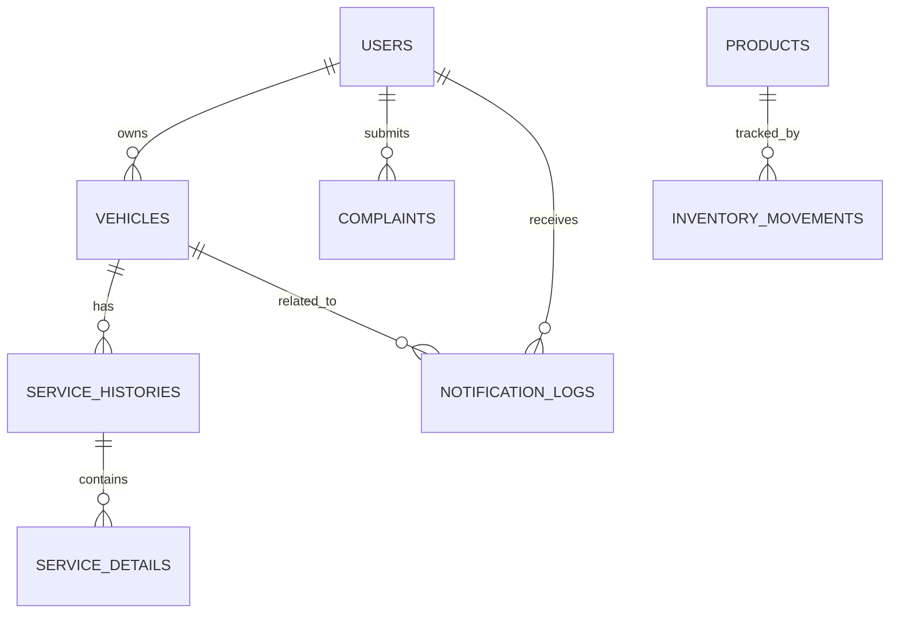

# DESAIN DATABASE AUTOSAMSI
## Sistem Manajemen Servis Otomotif Terintegrasi

Dokumen ini berisi rancangan database untuk aplikasi AutoSamsi yang mencakup manajemen pelanggan, kendaraan, servis, sparepart, complaint, notifikasi WhatsApp, dan laporan.

---

## 1. Tujuan Desain Database

Database dirancang untuk:
- Menyimpan data pelanggan dan kendaraan secara terstruktur.
- Mencatat transaksi servis beserta detail pekerjaan dan biaya.
- Mengelola inventori sparepart dan histori penggunaannya.
- Mencatat status servis dan status pembayaran.
- Menyimpan log notifikasi WhatsApp.
- Mendukung laporan harian dan bulanan.

---

## 2. Entitas Utama

Entitas utama pada sistem ini adalah:
- **users**: data pengguna sistem, baik admin maupun customer.
- **vehicles**: data kendaraan milik pelanggan.
- **service_histories**: transaksi servis setiap kendaraan.
- **service_details**: rincian pekerjaan atau jasa servis.
- **products**: data sparepart atau produk yang tersedia.
- **inventory_movements**: histori masuk dan keluar stok sparepart.
- **complaints**: keluhan pelanggan.
- **notification_logs**: log pengiriman WhatsApp.

---

## 3. Struktur Tabel

### 3.1 Tabel `users`
Menyimpan data pengguna sistem.

| Field | Tipe Data | Keterangan |
|---|---|---|
| id | bigint | Primary key |
| name | string | Nama pengguna |
| email | string, nullable | Email pengguna |
| password | string, nullable | Password login |
| whatsapp_number | string, nullable | Nomor WhatsApp |
| address | text, nullable | Alamat pelanggan |
| role | enum/string | admin atau customer |
| email_verified_at | timestamp, nullable | Verifikasi email |
| remember_token | string, nullable | Token login |
| created_at | timestamp | Waktu dibuat |
| updated_at | timestamp | Waktu diubah |

Relasi:
- Satu user dapat memiliki banyak vehicle.
- Satu user dapat memiliki banyak complaint.
- Satu user dapat menerima banyak notifikasi.

---

### 3.2 Tabel `vehicles`
Menyimpan data kendaraan milik pelanggan.

| Field | Tipe Data | Keterangan |
|---|---|---|
| id | bigint | Primary key |
| user_id | bigint | Foreign key ke users |
| brand | string | Merek kendaraan |
| model | string | Tipe/model kendaraan |
| engine_type | string, nullable | Tipe mesin |
| plate_number | string, unique | Nomor polisi |
| year | integer, nullable | Tahun kendaraan |
| last_service_date | date, nullable | Tanggal servis terakhir |
| oil_type | string, nullable | Jenis oli |
| next_service_date | date, nullable | Jadwal servis berikutnya |
| created_at | timestamp | Waktu dibuat |
| updated_at | timestamp | Waktu diubah |

Relasi:
- Satu vehicle dimiliki satu user.
- Satu vehicle memiliki banyak service_history.

---

### 3.3 Tabel `service_histories`
Menyimpan riwayat transaksi servis.

| Field | Tipe Data | Keterangan |
|---|---|---|
| id | bigint | Primary key |
| vehicle_id | bigint | Foreign key ke vehicles |
| service_date | date | Tanggal servis |
| service_type | string | Jenis servis |
| notes | text, nullable | Catatan tambahan |
| technician_name | string, nullable | Nama teknisi |
| status | enum | masuk, pengerjaan, selesai |
| invoice_status | enum | pending, lunas |
| total_cost | decimal(15,2) | Total biaya |
| spareparts | text, nullable | Ringkasan sparepart yang dipakai |
| paid_at | timestamp, nullable | Waktu pembayaran |
| next_service_date | date, nullable | Jadwal servis berikutnya |
| created_at | timestamp | Waktu dibuat |
| updated_at | timestamp | Waktu diubah |

Relasi:
- Satu service_history dimiliki satu vehicle.
- Satu service_history memiliki banyak service_detail.

---

### 3.4 Tabel `service_details`
Menyimpan rincian jasa atau item pekerjaan dalam satu transaksi servis.

| Field | Tipe Data | Keterangan |
|---|---|---|
| id | bigint | Primary key |
| service_history_id | bigint | Foreign key ke service_histories |
| name | string | Nama pekerjaan/jasa |
| price | decimal(15,2) | Harga jasa |
| created_at | timestamp | Waktu dibuat |
| updated_at | timestamp | Waktu diubah |

Relasi:
- Satu service_history memiliki banyak service_detail.

---

### 3.5 Tabel `products`
Menyimpan data sparepart atau produk yang tersedia.

| Field | Tipe Data | Keterangan |
|---|---|---|
| id | bigint | Primary key |
| name | string | Nama produk/sparepart |
| image_path | string, nullable | Gambar produk |
| shopee_url | string, nullable | Link produk eksternal |
| stock_qty | integer | Stok tersedia |
| minimum_stock | integer, nullable | Batas minimum stok |
| created_at | timestamp | Waktu dibuat |
| updated_at | timestamp | Waktu diubah |

Catatan:
- Jika ingin inventori lebih akurat, stok sebaiknya tidak hanya disimpan di field `stock_qty`, tetapi juga dicatat dalam histori mutasi stok.

---

### 3.6 Tabel `inventory_movements`
Menyimpan histori masuk dan keluar stok sparepart.

| Field | Tipe Data | Keterangan |
|---|---|---|
| id | bigint | Primary key |
| product_id | bigint | Foreign key ke products |
| movement_type | enum | in, out |
| quantity | integer | Jumlah stok masuk/keluar |
| reference_type | string, nullable | Referensi transaksi, misalnya service |
| reference_id | bigint, nullable | ID referensi transaksi |
| notes | text, nullable | Keterangan tambahan |
| created_at | timestamp | Waktu dibuat |
| updated_at | timestamp | Waktu diubah |

Relasi:
- Satu product memiliki banyak inventory_movement.

---

### 3.7 Tabel `complaints`
Menyimpan keluhan pelanggan.

| Field | Tipe Data | Keterangan |
|---|---|---|
| id | bigint | Primary key |
| user_id | bigint | Foreign key ke users |
| message | text | Isi complaint |
| status | enum/string | pending, in_progress, resolved |
| created_at | timestamp | Waktu dibuat |
| updated_at | timestamp | Waktu diubah |

Relasi:
- Satu user dapat memiliki banyak complaint.

---

### 3.8 Tabel `notification_logs`
Menyimpan log pengiriman pesan WhatsApp.

| Field | Tipe Data | Keterangan |
|---|---|---|
| id | bigint | Primary key |
| user_id | bigint | Foreign key ke users |
| vehicle_id | bigint | Foreign key ke vehicles |
| sent_at | timestamp | Waktu pesan dikirim |
| message_content | text | Isi pesan |
| status | enum/string | sent, failed |
| created_at | timestamp | Waktu dibuat |
| updated_at | timestamp | Waktu diubah |

Relasi:
- Satu user dapat memiliki banyak notification_log.
- Satu vehicle dapat memiliki banyak notification_log.

---

## 4. Relasi Antar Tabel

- `users.id` -> `vehicles.user_id`
- `users.id` -> `complaints.user_id`
- `users.id` -> `notification_logs.user_id`
- `vehicles.id` -> `service_histories.vehicle_id`
- `vehicles.id` -> `notification_logs.vehicle_id`
- `service_histories.id` -> `service_details.service_history_id`
- `products.id` -> `inventory_movements.product_id`

---

## 5. ERD Sederhana

---

## 6. Normalisasi Data

Desain database ini mengikuti prinsip normalisasi dasar:
- **1NF**: setiap kolom berisi nilai atomik.
- **2NF**: data transaksi dipisah dari data master.
- **3NF**: data yang berulang dipisahkan ke tabel relasi.

Contoh:
- Data pelanggan disimpan di `users`.
- Data kendaraan dipisah ke `vehicles`.
- Data transaksi servis disimpan ke `service_histories`.
- Rincian jasa disimpan ke `service_details`.
- Histori stok disimpan ke `inventory_movements`.

---

## 7. Index dan Constraint yang Disarankan

- `users.whatsapp_number` sebaiknya di-index jika sering dipakai untuk pencarian.
- `vehicles.plate_number` wajib unique.
- `service_histories.status` dan `invoice_status` memakai enum agar konsisten.
- `products.stock_qty` perlu validasi tidak boleh bernilai negatif.
- Foreign key menggunakan `on delete cascade` untuk data yang bergantung pada parent record.

---

## 8. Catatan Implementasi

Beberapa tabel yang sudah ada di project saat ini masih bisa ditingkatkan:
- Tabel `users` perlu tambahan field `address` untuk kebutuhan data pelanggan.
- Tabel `vehicles` dapat ditambah `engine_type` dan `year` agar sesuai kebutuhan proposal.
- Tabel `products` sebaiknya memiliki `stock_qty` dan `minimum_stock` untuk mendukung modul inventori.
- Jika ingin tracking sparepart lebih akurat, gunakan tabel `inventory_movements` sebagai histori stok.

---

## 9. Kesimpulan

Desain database AutoSamsi dibangun agar mampu mendukung seluruh proses bisnis bengkel, mulai dari pendataan pelanggan, pengelolaan kendaraan, pencatatan servis, kontrol stok sparepart, notifikasi WhatsApp, sampai penyusunan laporan.

Dokumen ini dapat digunakan sebagai bagian dari proposal maupun sebagai acuan teknis pengembangan sistem.
